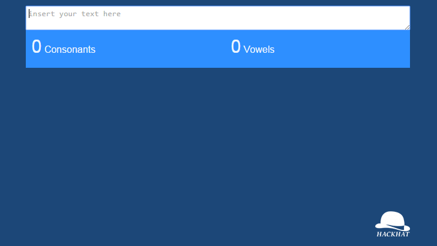

  

**[Live example](https://rawgit.com/hackhat/eike-test/v0.0.1/dist/index.html)**

## Setup

**Install**: Clone and run `npm install`.

**Dev mode**: To run in dev mode run the command `grunt serve` (If no browser opens go to: [http://localhost:8000/](http://localhost:8000/)).

**Tests**: To run tests you need to run the command `mocha` (you have to install it previously globally).

## Process:

 - Generated project with webapp generator: In this way everything is already setup
   and I can focus on the task instead of the setup of the project.
 - Created tests;
 - Implemented the logic code;
 - Implemented the user interface;
 - Added compatibility with +IE8;

## Programming assignment:

The goal is to allow the user to type in a text area and display the following information about the text that is typed:
1) number of consonants that appear in the text
2) number of vowels that appear in the text
2) the top 3 consonants and top 3 vowels used and how many times they appear in the text.

This all has to update as the user is typing.

We'd like to see how you would handle this problem without using any MV* frameworks.
jQuery or utility libraries are okay if you feel like you need any.

Things we would like to see:

- Unit tests (testing framework of your choice, headless or in-browser doesn't matter)
- Efficient and fast. Typing shouldn't cause any freezing.
- Separation of concerns. The DOM updates should be handled separately from the other logic.
- It should also work in IE8+ (we'll have to support IE8 for the near future unfortunately).
